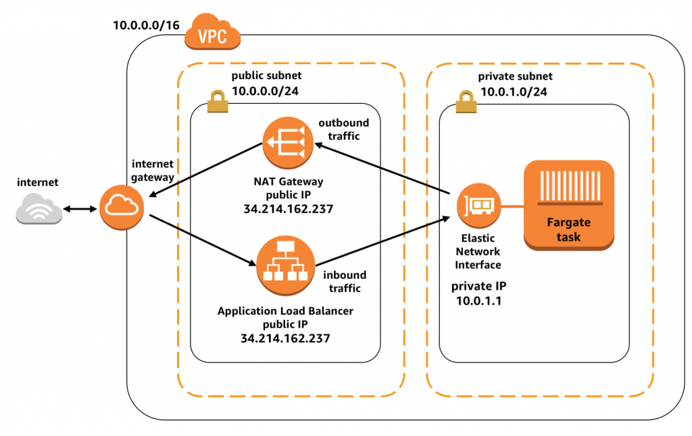

# Fargate Project Secured Deployment

A brief description of what this project does and who it's for

### 
<div align="center">
 
</div>


## Deployment

This project is to deploy fargate secured infrastructure in AWS using Terraform
Below are the list of resources that are meant to be created by terraform
 
 
Networking session
==================
1) VPC
2) nacl
3) public / private (private for fargate container, while public for loadbalacer)
4) internet-gateway (public)
5) nat-gateway   (for fargate container to go to internet)
6) route table (public) ==> interet-gateway
7) route table (private) ==> nat-gateway
8) security group (LB)
9) security group (fargate)

Container / Deployment
======================
10) Elastic Container Register (ECR)
11) Create Fargate container (ECS)


Terraform Deployment Steps
==========================
### 1) Terraform Initialization
```bash
  terraform init
```

### 2) Terraform Validate the Script
```bash
  terraform validate
```

### 3) Terraform Plan to review all resource which are to be created
```bash
  terraform plan
```


### 4) Terraform apply or apply --auto-approve to deploy all resource to AWS cloud
```bash
  terraform apply --auto-approve
```

### 5) Terraform destroy --auto-approve to deploy all resource to AWS cloud
```bash
  terraform destroy --auto-approve
```